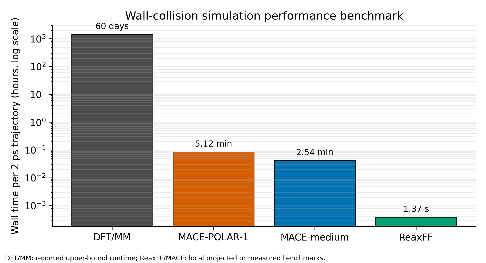

# ML Ionic-Liquid Fragmentation Benchmark

Code and workflow utilities for benchmarking ionic-liquid wall-collision
fragmentation with DFT/MM literature data, ReaxFF, MACE-medium, and
MACE-POLAR-1. The repository is intended to hold reproducible scripts and clean
workflow structure; large local datasets, raw trajectories, archived drafts,
and manuscript files are not tracked.



The benchmark above compares wall time for a nominal 2 ps wall-collision
trajectory. The DFT/MM value is the reported upper-bound runtime from the
reference calculation; ReaxFF and MACE values are local measured or projected
benchmarks from the matched workflow.

## Repository Layout

```text
assets/                 lightweight README figures
bash/                   shell entry points for simulation workflows
data/README.md          local-data inventory; data files are ignored by Git
references/             BibTeX and literature notes
scripts/analysis/       validation and analysis code
scripts/plotting/       plotting scripts for public figures
scripts/simulation/     ReaxFF and MACE-POLAR simulation drivers and inputs
environment.yml         starting conda environment
Makefile                lightweight validation and plotting commands
```

## Setup

```bash
conda env create -f environment.yml
conda activate emibf4-benchmark
```

Core analysis uses Python, NumPy, pandas, matplotlib, ASE, and networkx.
Optional simulations require external engines: LAMMPS with ReaxFF support for
ReaxFF cases and a compatible MACE/PyTorch installation for MACE-POLAR-1.

## Lightweight Commands

Validate compact result tables when local data are present:

```bash
make validate
```

Regenerate the README performance benchmark:

```bash
make benchmark
```

Run all lightweight checks:

```bash
make all
```

These commands do not launch expensive simulations.

## Optional Simulation Workflows

ReaxFF matched wall-collision cases:

```bash
export LAMMPS_EXECUTABLE=/path/to/lmp
JOBS=4 bash bash/run_reaxff_42.sh
```

MACE-POLAR-1 matched wall-collision cases:

```bash
DEVICE=cuda bash bash/run_mace_polar_42.sh
```

Simulation outputs are written under `results/`, which is ignored by Git.

## Data Policy

The public repository tracks code, small workflow inputs, notes, and lightweight
figures. Local result tables and trajectories are kept under `data/` and are
ignored by Git. See `data/README.md` for the expected local data layout and
which scripts consume each dataset.
